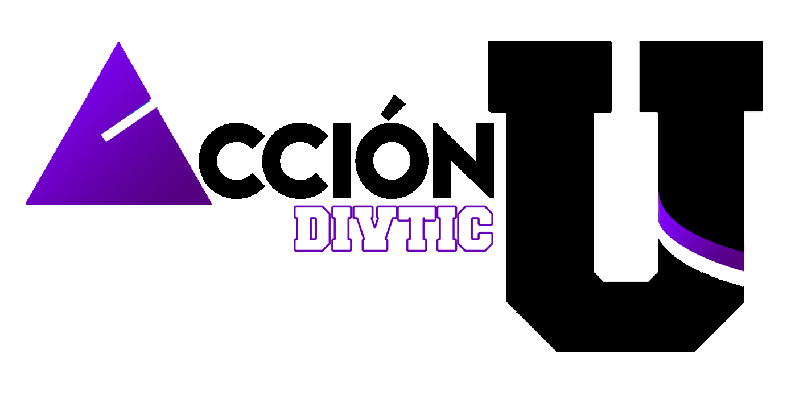

<a href="https://programacion-cucei.club"><picture><source media="(prefers-color-scheme: dark)" srcset="res/logo_club.gif"></picture></a>
 

<h3 align="center">Reglamento de convivencia para las comunidades del Club de Programación CUCEI</h3> 

> Última actualización: **03/03/2023 00:04**

Para garantizar la sana convivencia entre los miembros de nuestras comunidades hemos redactado el siguiente reglamento.

1. Al unirte a cualquiera de nuestras comunidades (ya sea en Discord o en WhatsApp) aceptas los lineamientos marcados en este reglamento, incluyendo todos los cambios posteriores. Estos cambios pueden realizarse en cualquier momento sin previo aviso, es tu responsabilidad comprobarlos.

1. El respeto es obligatorio hacia **TODOS** los miembros del club, independientemente de tu simpatía hacia ellos. Recuerda, *trata a los demás como quieres que te traten a ti*.

1. Está **PROHIBIDO** publicar fotos de otras personas sin su consentimiento en los grupos/canales del club.

1. El uso de groserías debe mantenerse al mínimo. De igual manera, se **prohibe** cualquier tipo de lenguaje despectivo hacia cualquier miembro.

1. Se prohibe el uso inadecuado de los grupos/canales de la comunidad. Les pedimos mantenerse *on-topic* en cada uno de estos y eviten los temas fuera del contexto del club.

1. A nadie nos gusta el spam. Les pedimos que eviten enviar una gran cantidad de mensajes pequeños uno tras de otro.

1. Queda **estrictamente prohibido** el compartir (o hacer referencia a) material pornográfico u otro tipo de material *NSFW*. Esto aplica en forma de fotografía, gif, sticker, emoji, etc.

1. No se permiten los nombres ni las fotos de perfil ofensivas. Se te pedirá que cambies tu nombre o foto si la comunidad o los líderes los considera inapropiados.

1. NO se tolerarán las amenazas directas o indirectas, en forma de doxxing, abuso, muerte, DDoS, entre otras amenzas maliciosas, a cualquier miembro del club.

1. Sigue los términos y condiciones de WhatsApp y de Discord (dependieno la comunidad a la que accedas). Estos los podrás encontrar en https://www.whatsapp.com/legal/terms-of-service/?lang=es y en https://discord.com/guidelines respectivamente.

1. El no leer las reglas **NO** te exime de las consecuencias.

1. Los líderes del club se reservan el derecho de aplicar sanciones (advertencia, silencio, expulsión; según la plataforma) de acuerdo a **su criterio**. Si tienes algún problema no tengas pena en contactar a alguno de los líderes y nosotros te ayudaremos.

 
<picture><source media="(prefers-color-scheme: dark)" srcset="res/accionu.png"></picture>

